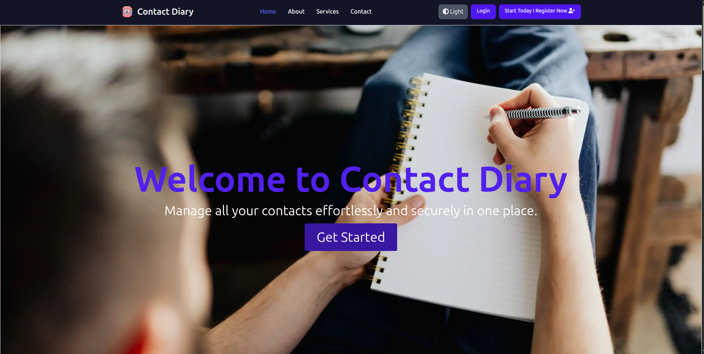
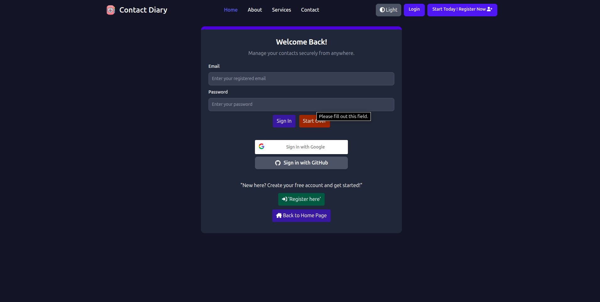
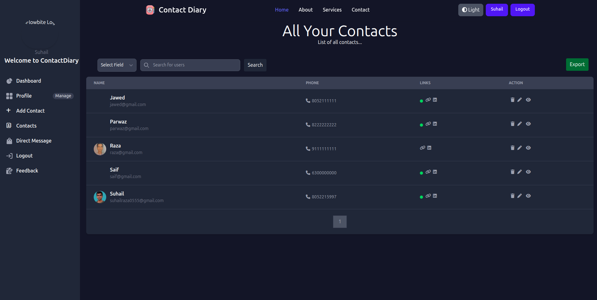

# Contact Management Web Application

A modern, professional, and responsive contact management web application built using **Spring Boot**, **Thymeleaf**, **Spring Security**, and **Tailwind CSS**. This platform enables users to register, log in, and manage their personal contacts through an intuitive user interface.

---

## 📈 Screenshots

Here’s how the UI looks:
View of **Home** Page:


View of **Login** Page:


View of **Contact Saved** Page:

---

## ✨ Features

- **User Registration & Login**: Secure registration and login functionality with Spring Security
- **Role-Based Access**: Access control for normal users and admin (if configured)
- **Contact Management**:
  - Add, edit, and delete contacts
  - Upload and manage profile images
- **Profile Management**: Users can update their profile details and password
- **Dark/Light Mode**: Fully responsive UI with dark and light themes using Tailwind CSS
- **Contact Page**: Users can view developer's contact info such as Email, GitHub, LinkedIn, etc.
- **Mobile Responsive**: Works seamlessly across devices

---

## 🚀 Tech Stack

| Frontend           | Backend     | Template Engine | Security        | Build Tool |
| ------------------ | ----------- | --------------- | --------------- | ---------- |
| HTML, Tailwind CSS | Spring Boot | Thymeleaf       | Spring Security | Maven      |

---

## ⚖️ Prerequisites

- Java 17+ (Java 21 preferred)
- Maven
- Spring Boot (3.x)
- Any IDE (STS, IntelliJ, VS Code)

---

## ⚙️ Getting Started

### 1. Clone the repository

```bash
git clone https://github.com/92Suhail/Contact-Diary.git
cd ContactDiary
```

### 2. Import into your IDE

- Open as Maven project
- Allow dependencies to resolve

### 3. Configure Application Properties

In `src/main/resources/application.properties`, configure:

```properties
spring.datasource.url=jdbc:mysql://localhost:3306/contact_manager
spring.datasource.username=root
spring.datasource.password=yourpassword

spring.jpa.hibernate.ddl-auto=update
spring.jpa.show-sql=true
spring.thymeleaf.cache=false
```

### 4. Run the Application

```bash
mvn spring-boot:run
```

Or run from IDE.

### 5. Access the Web App

```
http://localhost:8080
```

---

## 📚 Pages & Routing

| Route                 | Description                |
| --------------------- | -------------------------- |
| `/`                   | Home page                  |
| `/about`              | About us page              |
| `/contact`            | Contact developer page     |
| `/signup`             | User registration page     |
| `/signin`             | Login page                 |
| `/user/dashboard`     | User dashboard after login |
| `/user/add-contact`   | Add new contact            |
| `/user/view-contacts` | View and manage contacts   |
| `/user/profile`       | View user profile          |

---

## 📁 Folder Structure

```
src/
├── main/
│   ├── java/com/project/contactmanager
│   │   ├── controller/
│   │   ├── entity/
│   │   ├── repository/
│   │   ├── service/
│   │   └── config/
│   └── resources/
│       ├── templates/
│       │   ├── home.html
│       │   ├── about.html
│       │   ├── contact.html
│       │   ├── signup.html
│       │   ├── signin.html
│       │   └── user/
│       │       ├── dashboard.html
│       │       ├── view_contacts.html
│       │       └── add_contact.html
│       ├── static/
│       │   ├── assets/ (images, tailwind, icons)
│       └── application.properties
└── pom.xml
```

---

## 🌐 Contact Developer Page

Accessible from `/contact`, the page includes:

- ✉️ Email: [suhailraza0555@gmail.com](mailto\:yourname@example.com)
- 📲 Phone: +91-8052215997
- 👨‍💼 LinkedIn: [linkedin.com/in/yourprofile](https://www.linkedin.com/in/suhail-raza/)
- 💻 GitHub: [github.com/yourusername](https://github.com/92Suhail)

---

## 🛠️ Future Enhancements

- 🔍 **Role-Based Search**: Users can search contacts based on role (e.g., doctor, teacher) and location (address-based filtering)
- 🔐 **Private vs Public Contacts**: Users can mark contacts as private or public to control visibility across users
- 📅 **Call Scheduling & Alerts**: Users can schedule calls and receive automated reminders or notifications
- 📧 **Bulk Email Feature**: Email can be sent to multiple contacts at once with the same subject and message
- 🧠 **Smart Suggestions**: System can suggest contacts to users based on search patterns and role relevance
- 📨 **Broadcast Messaging**: Send common messages to selected group of contacts with just one click
- 🗓️ **Upcoming Events for Contacts**: See birthdays or anniversaries and get notified

---

## 🙏 Acknowledgments

Big thanks to the frontend template creators and icons designers used in this project. Also, credit to **D.K. Tiwari** and **Naresh IT** for backend learning resources.

---

## ❤️ Made with Spring Boot for everyday productivity!

> If you liked this project, give it a star ⭐ and follow for more Java/Spring Boot content.

